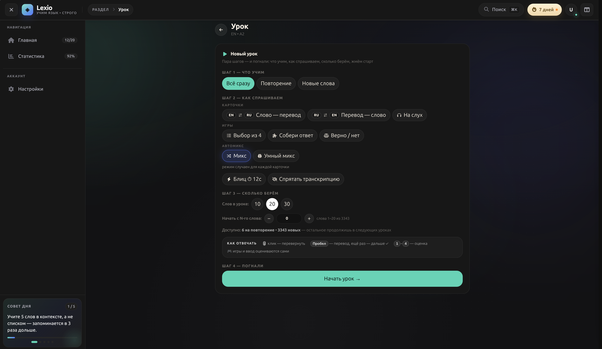
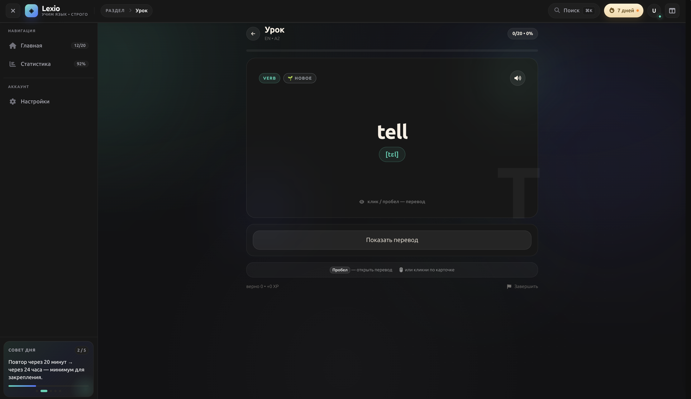

<p align="center">
  <span style="font-size:52px;font-weight:900;background:linear-gradient(135deg,#5AD4B5 0%,#5B74FF 100%);-webkit-background-clip:text;background-clip:text;color:transparent;">◈ LEXIO</span>
  <br/>
  <span style="font-size:20px;color:#94a3b8;">Фронтенд · учи языки красиво</span>
</p>

<p align="center">
  
  
  
  
</p>

<p align="center">
  
  
  
</p>

> SPA для языкового тренажёра **Lexio**: словари, интервальные повторения, достижения, серии и 3D-визуализации прогресса. Полный стек поднимается одной командой из [репозитория `infractructure`](https://github.com/Bogopodob/lexio_infractructure).

---

## 🖼️ Приложение в деле

<div align="center">
  
  <br/><br/>
  
  <br/><br/>
  
  <br/><br/>
  
  <br/>
</div>

> Нажми на скриншот — откроется в полном размере (~3600px).

---

## ✨ Возможности

- **Словари и поиск** — тысячи записей с переводами, частотные списки по частям речи;
- **Интервальные повторения** — умные сессии обучения с дистракторами и подсказками;
- **Геймификация** — достижения, серии (streak), еженедельная статистика, лидерборд друзей;
- **Личный контент** — карточки, фразы, медиа, озвучка и распознавание речи;
- **3D и графики** — прогресс визуализируется через `three.js` / `react-three-fiber` и `visx`-чарты;
- **Тёмная тема** — тёмный интерфейс с фирменным градиентом `#5AD4B5 → #5B74FF`.

## 🧱 Технологии

| Слой | Стек |
|---|---|
| Язык | TypeScript 5.9 |
| UI | React 19, React Router 6, HeroUI, Tailwind CSS 4, `@base-ui/react` |
| Анимации | framer-motion, GSAP, number-flow |
| 3D | three, `@react-three/fiber`, `@react-three/drei`, ogl |
| Графики | `@visx/*` (curve, gradient, grid, shape, scale…) |
| Сборка | Vite 7, API-урл через `VITE_API_URL` |

---

## 🚀 Быстрый старт

### Локальная разработка (фронтенд отдельно)

```bash
npm install
npm run dev        # http://localhost:5173
```

API урл по умолчанию — `/api` (тот же хост). Для отдельного API укажите вручную:

```bash
VITE_API_URL=http://localhost:8080/api npm run dev
```

### Полный стек (рекомендуется)

Backend, nginx, postgres, rabbitmq и vite-фронтенд поднимаются из [репозитория `infractructure`](https://github.com/Bogopodob/lexio_infractructure):

```bash
git clone git@github.com:Bogopodob/lexio_infractructure.git
cd infractructure
make up                 # dev-стек: php + vite фронтенд + postgres + rabbitmq + xdebug
make frontend-shell     # шелл в контейнер фронтенда
```

### Сборка для продакшена

```bash
npm run build          # tsc -b && vite build → dist/
```

При прод-сборке `VITE_API_URL` зашивается в бандл:

```bash
VITE_API_URL=http://api.lexio.curatio.space:81/api npm run build
```

Готовый `dist/` копируется в `frontend-dist/` — именно эту директорию nginx монтирует читать-only и раздаёт на `app.lexio.curatio.space:81`.

---

## 🌐 Ссылки

| Репозиторий | Назначение |
|---|---|
| [lexio_frontend](https://github.com/Bogopodob/lexio_frontend) | этот проект |
| [lexio_backend](https://github.com/Bogopodob/lexio_backend) | Laravel API (модули Auth/Catalog/Learning/Library/User) |
| [lexio_infractructure](https://github.com/Bogopodob/lexio_infractructure) | docker-compose (dev/prod), Makefile, deploy.sh |

---

<p align="center">
  <span style="color:#5ad4b5;">◈</span> <span style="color:#94a3b8;">Lexio — сделано с любовью к языкам</span>
</p>